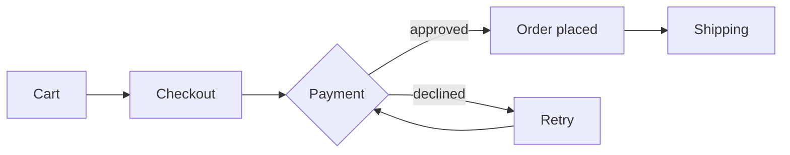

# Order Service: Design Notes

A short tour of what the Markdown Viewer renders: tables, task lists, code, quotes and diagrams.

## 1. Status

| Area | Owner | Status | Due |
|---|---|---|---|
| Checkout API | Backend | **In review** | Oct 10 |
| Payment retry | Backend | In progress | Oct 17 |
| Order history page | Frontend | Done | Sep 30 |
| Load test | QA | Not started | Oct 24 |

- [x] Agree on the order states
- [x] Draft the checkout API
- [ ] Decide the retry limit for payments
- [ ] Book the load test environment

> **Decision needed:** retry a failed payment three times, or hand it to support after the first failure?

## 2. Order flow



## 3. Checkout sequence

```plantuml
actor Customer
participant "Web shop" as Shop
participant "Payment gateway" as Pay
database Orders
Customer -> Shop : place order
Shop -> Pay : authorize amount
Pay --> Shop : approved
Shop -> Orders : save order
Shop --> Customer : confirmation
```

## 4. API

```java
@PostMapping("/orders")
public ResponseEntity<Order> place(@RequestBody Cart cart) {
    Order order = checkout.place(cart);
    return ResponseEntity.created(URI.create("/orders/" + order.id())).body(order);
}
```

Retries use `backoff = base * 2^attempt`, capped at 30 seconds.
